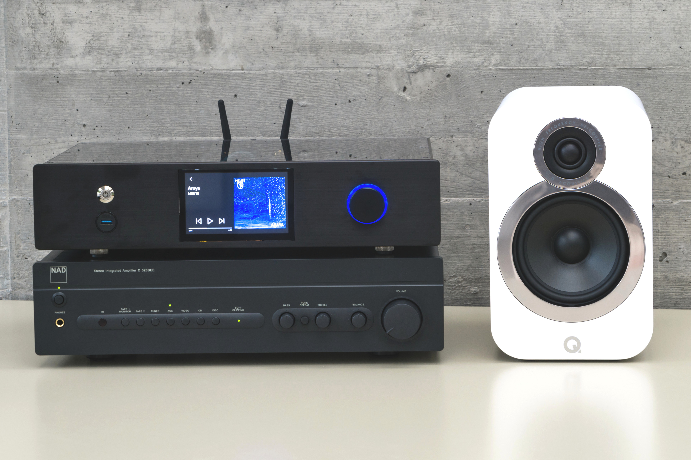

# Audio-Streamer Hardware Wiki

First prototype of the audio-streamer with amplifier and speaker.

## Summary

The aim of this hardware project is to enable high-end audio equipment to play audio from streaming sources. Therefore, the audio-streamer is build with high-quality components. The modular concept allows the user/developer to change parts of the streamer to test different hardware components or to adjust the hardware to the users taste. The audio-streamer can be used with a touch-screen or as headless in HiFi rack.

## Structure

-   Concept
-   Modules
    -   Carrier boards
    -   DAC
    -   Filter
    -   Isolator
    -   Power supply
-   CAD
-   Measurements

## Present State

The second prototype (rev. 1.1) is being assembled. (2019-10-09)
